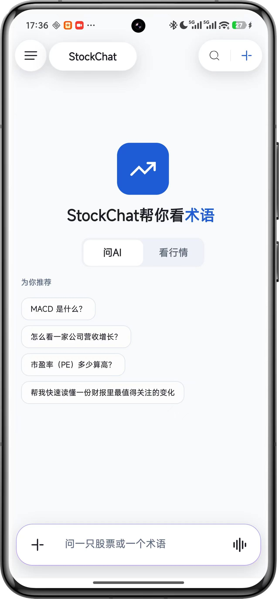
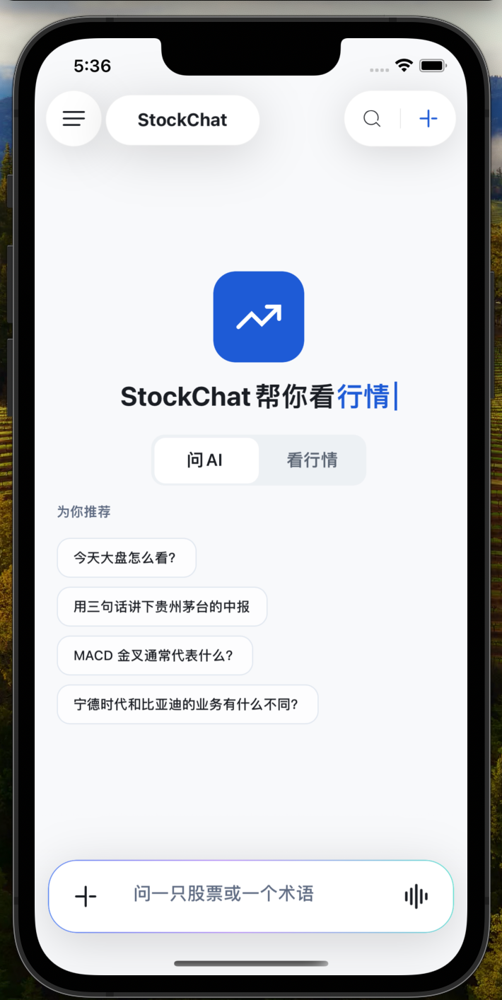
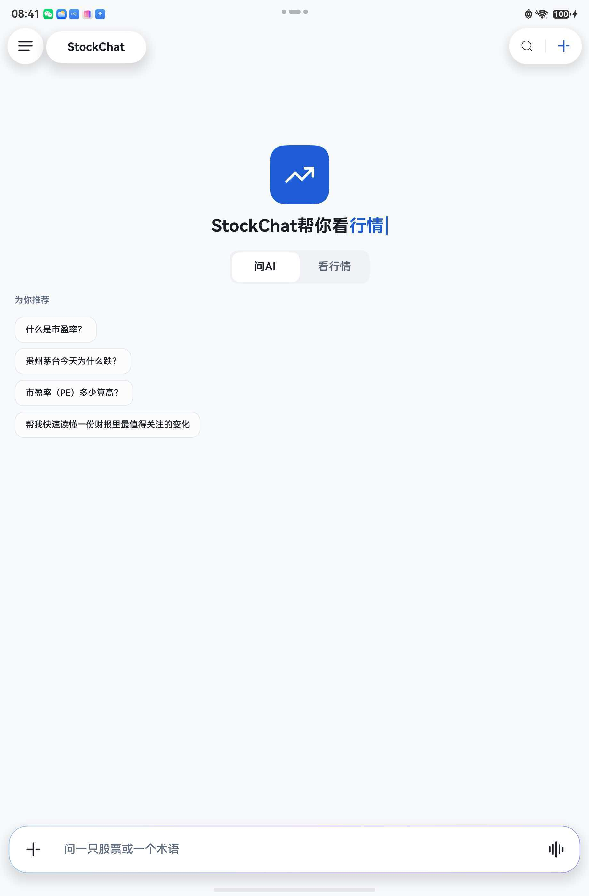
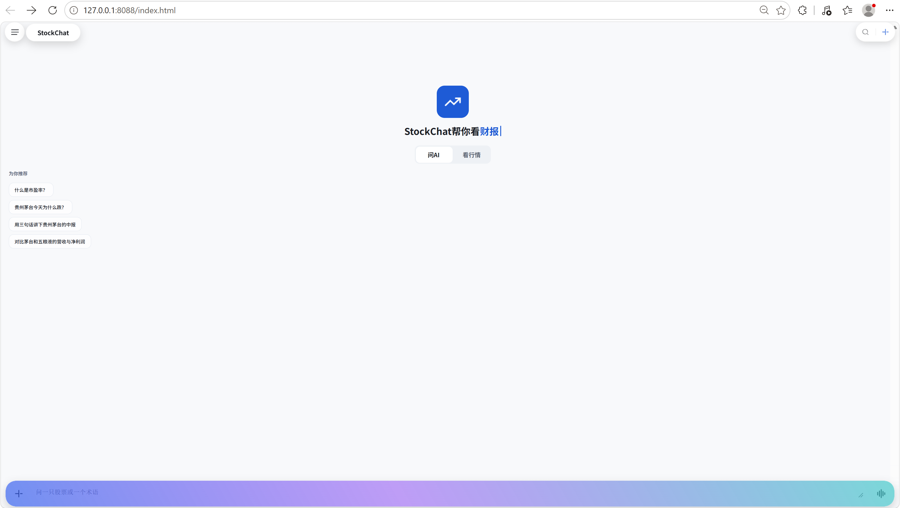

<div align="center">


# 股问 · StockChat

**做股民的解释器，不做荐股机。**

基于 Kotlin Multiplatform 与腾讯 Kuikly 构建的跨端 AI 股票工作台。用户可以用自然语言提问，在流式回答中直接查看可点击的实时行情卡片，再进入个股详情继续研究走势、事件与风险。

项目用一套共享业务与 UI 代码运行在 **Android / iOS / OpenHarmony（鸿蒙）/ H5（Web）**，把 AI 对话、行情数据、结构化卡片、金融图表和会话上下文串成一条完整链路。

[Kotlin Multiplatform] · [Kuikly 2.25.0] · [JDK 17] · [Gradle 8.7] · [AGP 8.5.2]

</div>

<div align="center">

[项目亮点](#项目亮点) · [架构设计](#项目架构) ·  [四端跑通](#四端跑通--拉下项目以后) · [四端运行](#四端演示视频) · [测试质量](#测试与代码质量)

</div>

---

## 一分钟体验路径

1. 播放任意一个四端演示视频（推荐安卓，做了功能介绍），查看「聊天提问 → 行情卡片 → 个股详情 → 返回追问」主链路。
2. Android 用户可直接安装仓库内的 Release APK；其他平台按下文步骤自行构建。
3. 进入「API 设置」，推荐「小米 MiMo」(有多模态)，填入自己的 API Key 并通过连接测试。
4. 输入「茅台和五粮液最近怎么样」，体验 Markdown、实体识别灵动岛与实时行情卡片混排，感受交互与数据的碰撞吧~。

---

## 四端同时运行的真实样貌

> 同一份 Kuikly 共享代码，在 **Android 手机 · iOS（iPhone 13）· OpenHarmony 平板 · H5 浏览器** 四种设备形态上的真实运行截图。

<div align="center">

| Android 手机 | iOS | OpenHarmony | H5（Web） |
| :---: | :---: | :---: | :---: |
|  |  |  |  |


<sub>四端共用同一套顶栏（☰ 会话抽屉 / 全局搜索 / 新建会话）、同一套欢迎区（App 图标 +「StockChat 帮你看 ×××」+ 问 AI / 看行情 双 Tab）与同一套底部输入栏（+ / 按住说话 / 声波）；差异只落在状态栏、系统手势区与浏览器外壳。「为你推荐」的问题取自端侧话题池并按会话轮换，所以各张截图里的推荐问题各不相同——这正是同一份业务代码、不同入口上下文的体现。</sub>

</div>

---

## 四端演示视频

每个视频演示同一段问股流程在四端真实环境上的表现（流式打字机、行情卡混排、点击下钻详情、长按实体弹灵动岛）。

| 端 | 演示视频 | 内容亮点 |
| :--- | :---: | :--- |
| **Android** | [📥 推荐下载 / 含字幕播放](assets/videos/android-demo.mp4) | 主流验证端；录制的功能最齐全|
| **iOS** | [📥 下载 / 播放](assets/videos/ios-demo.mp4) | iOS 原生手势；Kuikly 与 UIKit 互不打架 |
| **OpenHarmony（鸿蒙）** | [📥 下载 / 播放](assets/videos/ohos-demo.mp4) | 鸿蒙原生渲染管线下 K 线 / 卡片混排 |
| **H5（Web）** | [📥 下载 / 播放](assets/videos/h5-demo.mp4) | 浏览器直跑同一份 Kotlin 代码；跑起来的三步见 [§ H5（Web）](#h5web) |


---

## 立即下载

| 产物 | 下载 | 说明 |
| :--- | :---: | :--- |
| **Android Release 包** | [📥 `releases/StockChat-android-release.apk`](releases/StockChat-android-release.apk) | arm64-v8a · 22.9 MB · arm64-v8a 单架构 · minSdk 23 / targetSdk 34 |

SHA-256：`7749A8742BCD92206F2D00C143AC9E4BDE6ED8B8A0BEB1A5403B57BEDCFC09B1`

---

## 项目亮点

### 可信的 AI 股票解释

- **模型负责表达，端侧负责事实**：LLM 只生成正文与结构化卡片意图；卡片中的价格、涨跌幅、K 线等行情字段由端侧 Provider 注入，避免把模型生成的数字当成实时行情。
- **数据状态可追溯**：真实接口 → 本地缓存 → 确定性离线数据三级降级，行情卡持续展示数据来源与抓取时间，不用 Mock 冒充在线结果。
- **产品边界克制**：定位是“解释器”而不是“荐股机”，不提供目标价、买卖指令或收益承诺。

### 不止是聊天框

- **文本、卡片、实体三流合一**：Markdown 流式回答与 14 类结构化卡片混排；股票名、代码和术语可识别、下钻、长按预览或拖入输入框。
- **聊看一体闭环**：提问 → 混排回答 → 行情 / 实体下钻 → 个股详情 → 返回并恢复会话位置，研究过程不丢上下文。
- **多模态与输入增强**：支持图片提问、按住说话、`@` 标的联想和 `/` 指令面板；平台能力不可用时提供明确降级提示。
- **协议驱动卡片**：行情侧 7 类 + 数据侧 7 类卡片，支持 `FULL / COMPACT / MINI` 三种密度；未知协议有兜底渲染，流式 JSON 未闭合时先展示骨架。

### 真正的跨端工程

- **一套共享业务与 UI**：Android、iOS、OpenHarmony 共用 Kotlin Multiplatform + Kuikly 实现，不是三套外观相似的页面。
- **commonMain 自绘图表**：分时 / 日 / 周 / 月 K、MA5/10/20、均价线、十字光标与时间刷均由纯 Kotlin Canvas 实现，坐标和刻度算法可单测。
- **平台差异集中收口**：网络、调度、动效策略与宿主能力通过 `expect/actual` 和 `PlatformPolicy` 隔离，单端兼容修复不会扩散到业务层。
- **质量门禁进入构建链**：373 个单元测试覆盖协议、行情解析、图表算法、实体识别与域状态机；`architectureCheck` 阻止新增反向依赖。

---

## 项目架构

StockChat 采用 **Kotlin Multiplatform + Kuikly 的共享优先架构**：产品规则、页面和绝大多数 UI 都在 `shared` 中实现；各端宿主只负责启动 Kuikly、提供系统能力和打包。这样一个功能从聊天流到行情详情的行为，在 Android、iOS、OpenHarmony 和 H5 上有相同的业务定义，而不是四套代码分别追赶。

### 先看仓库：模块各自负责什么

```text
StockChat/
├── shared/                       共享业务与 Kuikly UI：项目的主体
│   └── src/
│       ├── commonMain/            四端共用的页面、领域逻辑、协议、数据抽象
│       ├── commonTest/            可脱离 UI 运行的单元测试
│       ├── androidMain/           Android 的 actual 实现（OkHttp、时钟等）
│       ├── iosMain/               iOS 的 actual 实现（Darwin、系统能力等）
│       ├── jsMain/                H5 的 actual 实现（浏览器存储、路由等）
│       └── ohosArm64Main/         OpenHarmony 的 actual 实现与兼容回退
├── androidApp/                    Android 宿主：Activity、Android 打包配置
├── iosApp/                        iOS 宿主：Xcode 工程、Pod 与 UIKit 入口
├── h5App/                         Web 宿主：Kotlin/JS 构建产物与网页入口
├── ohosApp/                       鸿蒙宿主：ArkTS/Native 工程、HAP 打包配置
├── assets/                        README 图片、演示视频等对外资源
├── docs/architecture/             架构规则与门禁说明
└── scripts/                       构建、H5 回归和架构检查脚本
```

**日常开发默认从 `shared/src/commonMain` 开始。** 只有某项能力确实依赖操作系统或运行时，才通过 Kotlin 的 `expect/actual` 下沉到对应平台源集；不要为同一个产品功能在四个宿主目录重复实现。

### 共享代码的业务地图

```
shared/src/commonMain/kotlin/com/kuikly/stockchat
├── page/                  13 个 Kuikly 页面；仅做页面装配、路由和 UI effect 适配
├── chat/                  聊天域：会话、流式回复、欢迎区、实体与抽屉状态
├── detail/ watchlist/ risk/     个股详情、自选、风险等 feature 的 domain / state / component
├── cards/                 14 类结构化卡片渲染器，以及 FULL / COMPACT / MINI 三种密度
├── protocol/              AI 输出协议：SSE 切分、意图块识别、CardPayload 解析与容错
├── chart/                 分时/K 线的数据模型、坐标计算和 Canvas 绘制算法（纯 Kotlin）
├── composer/ richtext/ voice/   输入编排、Markdown/实体富文本、语音交互
├── data/                  数据端口与实现：AI、行情、缓存、配置、存储、确定性离线数据
├── foundation/            跨 feature 可复用的设计 token、基础 UI、图标和工具
├── common/ base/          路由、平台策略、通用模型与基础能力
└── app/
    ├── assembly/          依赖装配根（FeatureGraph）；Provider 在这里创建并注入 feature
    └── platform/          Kuikly/浏览器存储等适配器
```

可以把目录按职责理解为四类：`page` 负责“**显示与转场**”，各 feature 负责“**状态和交互**”，`data` 负责“**事实与持久化**”，`foundation/common` 负责“**任何 feature 都可依赖的基座**”。`cards`、`chart`、`protocol` 是跨 feature 的垂直能力，不承担页面路由或数据源构造。

### 四层依赖：谁可以依赖谁

| 层 | 职责 | 依赖方向 |
| :--- | :--- | :--- |
| **Page** | `page/*Page.kt`；组装页面、接收路由参数、承接一次性 UI effect | → feature component/state → data 的公开端口 |
| **Component** | 各 feature 的 `component/` 与基础 UI；只渲染只读状态并发出 Action | → state/domain；不直接请求网络或读存储 |
| **State / Domain** | `state/`、Coordinator、Reducer、领域模型；拥有状态迁移和业务用例 | → data 端口；可用 fake 在 commonTest 中验证 |
| **Data / Platform** | Provider、Repository、Cache、Storage 与平台 `actual` 实现 | → 网络、存储、平台 SDK；绝不反向依赖 UI |

```text
Page ──────▶ Component ──────▶ State / Domain ──────▶ Data port / Repository
  │                │                    │                       │
  │                └──── reads state ───┘                       ▼
  └── route / UI effect                                    Network · Cache · Storage

foundation / common  ◀──── 可被上面所有层依赖；自身不能依赖任一 feature 或 page
platform actual      ◀──── 只在边缘替换 HTTP、存储、时钟、导航与渲染策略
```

- **页面不直接构造 Provider**：`app/assembly/ChatFeatureGraph`、`MarketFeatureGraph` 等是依赖的唯一装配点。
- **组件不直接访问 Provider / Repository / Storage**：组件参数应是只读数据和回调；状态层决定何时加载及如何降级。
- **平台差异不外溢**：公共代码依赖 `expect` 声明或平台端口；`androidMain`、`iosMain`、`jsMain`、`ohosArm64Main` 提供 `actual`。
- **规则不是建议**：`./gradlew :shared:architectureCheck` 会扫描依赖方向；白名单只记录已有、带删除计划的债务。完整规则见 [架构分层规则](docs/architecture/package-rules.md)。

### 从启动到页面：运行时如何装配

```text
Android / iOS / H5 / OpenHarmony 宿主
                 │ 启动 Kuikly 页面并传递路由参数
                 ▼
          shared/page/*Page
                 │ 从 FeatureGraph 取得 feature dependencies
                 ▼
       feature state / coordinator / component
            │                       │
            │ UI state              └── Action（提问、刷新、收藏、切换）
            ▼
       Kuikly reactive UI  ◀─────────────────────────────────────┘
                 │
                 ▼
   data Provider / Repository → HTTP、缓存、配置、离线数据
```

页面是短生命周期的 UI 入口；会话、加载、错误、刷新和选择等可测试状态应该落在 feature 的状态机或协调器中。依赖通过 Graph 注入，因而单测可以传入 Fake Provider、Fake Scheduler 或内存 Storage，而无需启动任一端的 Kuikly 运行时。

### 聊天请求链路：模型给意图，端侧给事实

```
用户问题 / 语音
        │
        ▼
ChatViewModel（依赖经 ChatDependencies 注入）
        │
        ├─ 正文分支   OpenAiCompatAiProvider ──SSE──▶ AiResponseLexer 边流边切
        │                    │                            ├─ Markdown 正文流（打字机渲染）
        │                    │                            └─ ```card:xxx 意图块 ─▶ CardPayloadParser ─▶ CardRegistry 分发
        ├─ 实体分支   Trie 最长匹配 + 会话上下文消歧 ─▶ 实体高亮 / 长按灵动岛
        └─ 行情分支   QuoteRepository ─▶ 腾讯 / 东财 Provider ─▶ 卡片数字端侧填充
        │
        ▼
混排回答（Markdown / 行情卡 / 图片）──卡片或实体点击──▶ StockDetailPage
```

这里最重要的边界是：**模型不拥有行情事实。** AI 只返回 Markdown 和卡片“意图”；`CardPayloadParser` 将意图变为安全的协议对象，`QuoteRepository` 再用真实接口、缓存或离线数据补齐价格、涨跌幅和 K 线。这样即使模型输出过时或不完整，卡片仍可显示数据来源与抓取时间。

### 数据层降级策略

```
┌──────────────┐    命中    ┌──────────────────────┐
│ 真实接口调用 │──网络异常──▶│ 本地缓存 QuoteCache  │
│ 腾讯 / 东财  │            │  (TTL 内复现)         │
└──────┬───────┘            └──────────┬───────────┘
       │ 成功                          │ 缓存 miss
       ▼                               ▼
   ┌────────────┐              ┌────────────────────┐
   │ 在线真实    │              │ 确定性离线 Mock     │
   │ UI 标注时间 │              │  UI 标注"离线演示"   │
   └────────────┘              └────────────────────┘
```

### 新功能应该放在哪里

| 需求 | 推荐落点 | 不应该做的事 |
| :--- | :--- | :--- |
| 新页面或新路由 | `page/`，由已有 Graph 注入依赖 | 在页面里 new Provider、维护复杂定时器 |
| 某一业务的状态、刷新与交互规则 | 对应 feature 的 `state/` / `domain/` | 让组件直接修改存储或发网络请求 |
| 新卡片协议或流式解析规则 | `protocol/` + `cards/` | 把未验证的 AI 原文直接当行情数值展示 |
| 复用 UI / token / 图标 | `foundation/` | 向历史 `page/components/` 新增通用文件 |
| API、缓存、配置或 Mock | `data/` | 从数据层 import Page、View 或导航能力 |
| 平台专有实现 | 对应 `*Main` 源集的 `actual` | 在 commonMain 中散落平台条件判断 |

提交前至少运行 `./gradlew :shared:architectureCheck`；涉及共享业务逻辑时再运行 `./gradlew :shared:testDebugUnitTest`。这样新增功能既能跨端复用，也不会逐步把页面变成数据和时序的“万能入口”。

---

## 四端跑通 · 拉下项目以后

> **共同的先决条件**：JDK 17、Gradle 8.7（仓库内 `./gradlew`）、Kotlin 2.1.21（OHOS 变体 2.0.21-ohos）、Kuikly 2.25.0-2.1.21。
>
> **共同的配置动作**：App 启动后进入聊天页 → 右上角「⋮」→「API 设置」，填入 API 地址 / 模型名 / Key，先「测试连接」通过再保存；配置只存当前设备，**不写源码、不写 `local.properties`、不写 URL 参数、不写 `BuildConfig`**。

### 一次性迁移：`.kotlin` 构建缓存已移出版本库（2026-09-14）

历史提交曾把 Kotlin 插件的本机构建缓存（`.kotlin/` 下 8 个文件）误入库，内容是构建机器的绝对路径，导致每台机器构建后 `git status` 都出现无意义的「已修改」。现已解除跟踪（`.gitignore` 早已覆盖 `.kotlin/`），影响如下：

- **全新克隆**：无感，构建后 `.kotlin/` 由 gitignore 自动忽略，`git status` 保持干净。
- **在旧版本基础上构建过的本地仓库**：pull 时 git 会提示本地 `.kotlin` 改动会被合并覆盖并拒绝执行，这是预期行为。先丢弃缓存改动再拉取即可（**一次性**，之后不再出现）：

```bash
git restore .kotlin && git pull    # 或 git checkout -- .kotlin
```

### 数据来源说明（请阅读后再调试各端）

| 端 | 行情数据来源 | 备注 |
| :--- | :--- | :--- |
| Android | 腾讯证券 `qt.gtimg.cn`（GBK）、东财 `push2/push2ex/datacenter-web` | HTTPS，间隔 ≥ 200 ms；UA 已配 |
| iOS | 同上 | iOS App Transport Security 默认放行 HTTPS |
| OpenHarmony | 同上 | 部分鸿蒙模拟器对 GBK 解析需走 GBK→UTF-8 兼容路径 |

> ⚠️ **如果免费公开数据来源临时失效**（腾讯 `qt.gtimg.cn` 或东财任何接口报超时 / 403 / 解析异常），请在 App 内进入「设置 → 数据源 → 数据接入方式」切换到 **Mock 离线演示**，所有行情卡会回落到确定性数据，并在卡顶显式标注「离线演示」与数据时点；切回「在线真实」即可恢复。
>
> **不要把 Mock 当在线结果。** UI 顶部小字就是给你和评审看数据状态的。

---

### Android

Windows / macOS / Linux 命令相同。

```bash
# 1. 构建 Debug APK（约 4–8 分钟）
./gradlew :androidApp:assembleDebug

# 2. 安装到已连接的真机或模拟器
adb install -r androidApp/build/outputs/apk/debug/androidApp-debug.apk

# 3. 启动
adb shell am start -n com.kuikly.stockchat/.KuiklyRenderActivity
```

**Release 包**：

- **直接使用仓库自带的** [Release 包](releases/StockChat-android-release.apk)：先校验 SHA-256（见 §「立即下载」），再
  ```bash
  adb install -r releases/StockChat-android-release.apk
  adb shell am start -n com.kuikly.stockchat/.KuiklyRenderActivity
  ```
- 自构建：`./gradlew :androidApp:assembleRelease`（签名请按 §「构建产物 & 签名」自行配置）。

**特殊情况**：

- 首次运行前确认 `local.properties` 已设置 `sdk.dir`。
- `Gradle fileHashes.lock` 访问被拒 → 先 `./gradlew --stop` 再重试。
- 临时 Mock：见上文「数据来源说明」。

### iOS

macOS + Xcode 15.3+（验证环境：Xcode 15.3 / iOS 17.4 SDK）+ CocoaPods + JDK 17。

**先确认芯片架构，后面命令里的 `archs` 参数跟它走**：

| 你的 Mac 芯片 | 模拟器 `archs` | 真机 `archs` |
| :--- | :--- | :--- |
| Intel | `x86_64` | `arm64` |
| Apple Silicon（M1/M2/M3…） | `arm64` | `arm64` |

#### 方式 A：Xcode 图形界面跑（三步）

```bash
# 1. 编译并把 KMP Framework 同步到 Pod 引用位置（约 1–2 分钟，已构建过会秒过）
./gradlew :shared:syncFramework -Pkotlin.native.cocoapods.platform=iphonesimulator -Pkotlin.native.cocoapods.archs=x86_64 -Pkotlin.native.cocoapods.configuration=Debug
#    Apple Silicon 把 archs=x86_64 改为 archs=arm64；真机调试用 -Pkotlin.native.cocoapods.platform=iphoneos

# 2. 安装 Pod 依赖
cd iosApp && ./install-pods.sh && cd ..   # pod install 的兜底封装：自动绕过系统 Ruby 2.6 的
                                          # concurrent-ruby/activesupport logger 兼容坑与 locale 编码坑

# 3. 用 Xcode 打开工作空间
open iosApp/iosApp.xcworkspace   # 选 iosApp target → Run (⌘R)，Xcode 会按所选目标自动重新同步 Framework
```

#### 方式 B：纯命令行全流程（不打开 Xcode，直接推到模拟器）

> 全程已在 Intel Mac（Xcode 15.3）从零验证通过。改了 Kotlin 共享代码后，只需重跑第 1、4、6 步。

```bash
# 1. Framework 同步（命令同方式 A 第 1 步）
./gradlew :shared:syncFramework -Pkotlin.native.cocoapods.platform=iphonesimulator -Pkotlin.native.cocoapods.archs=x86_64 -Pkotlin.native.cocoapods.configuration=Debug

# 2. 安装 Pod 依赖
cd iosApp && ./install-pods.sh && cd ..

# 3. 编 Pods 依赖（OpenKuiklyIOSRender / SDWebImage / shared）——不能跳过，
#    命令行 -project 直构不会自动编 Pods，跳过会报 no such module 'stockchat'
cd iosApp && xcodebuild -project Pods/Pods.xcodeproj -target Pods-iosApp \
  -configuration Debug -sdk iphonesimulator \
  ARCHS=x86_64 ONLY_ACTIVE_ARCH=YES build && cd ..

# 4. 编主工程（产物 iosApp/build/Debug-iphonesimulator/iosApp.app）
cd iosApp && xcodebuild -project iosApp.xcodeproj -target iosApp \
  -configuration Debug -sdk iphonesimulator \
  ARCHS=x86_64 ONLY_ACTIVE_ARCH=YES \
  ASSETCATALOG_COMPILER_APPICON_NAME= ASSETCATALOG_COMPILER_LAUNCHIMAGE_NAME= build && cd ..

# 5. 准备模拟器：找一台可用的 iPhone 并启动（以 iPhone 13 为例）
xcrun simctl list devices available | grep "iPhone"      # 挑一台，记下 UDID
xcrun simctl boot <UDID> 2>/dev/null || true             # 已启动会静默跳过
open -a Simulator                                        # 调出模拟器窗口

# 6. 安装 + 启动（bundle id 固定为 orgIdentifier.iosApp）
xcrun simctl install <UDID> iosApp/build/Debug-iphonesimulator/iosApp.app
xcrun simctl launch <UDID> orgIdentifier.iosApp

# （可选）确认进程存活：有输出即存活
xcrun simctl spawn <UDID> launchctl list | grep iosApp
```

#### 真机调试

1. 第 1 步命令换成 `-Pkotlin.native.cocoapods.platform=iphoneos -Pkotlin.native.cocoapods.archs=arm64`；
2. USB 连接真机，在 Xcode 里选设备 Run（方式 A 第 3 步），签名使用自己的开发者证书。

#### 排坑快查（iOS）

| 现象 | 原因与修法 |
| :--- | :--- |
| `pod install` 报 `Kotlin framework 'stockchat' doesn't exist yet` | 第 1 步没跑或产物被清理，重跑第 1 步再 `./install-pods.sh` |
| `pod install` 报 `uninitialized constant ... Logger` / `Encoding::CompatibilityError` | 用 `./install-pods.sh`（仓库内置，自动探测绕过）；仍失败跑 `cd iosApp && pod repo update --verbose` |
| `xcodebuild: error: You cannot specify targets with a workspace` | `-workspace` 与 `-target` 互斥。命令行构建统一用 `-project`（见方式 B）；workspace+scheme 只适合 Xcode GUI |
| `xcodebuild: error: Found no destinations for the scheme ...`（exit 70） | 命令行下 workspace+scheme 解析不出 destination（本仓库验证环境如此），改走方式 B 的 `-project` 两步构建 |
| 链接报 `Undefined symbols for architecture arm64`（KRBaseModule / KuiklyRenderBridge 等） | 没指定 destination 时 xcodebuild 会把 arm64 也编进来，而 Framework 只有当前芯片架构。命令行构建必须带 `ARCHS=x86_64 ONLY_ACTIVE_ARCH=YES`（Apple Silicon 相应改为 `ARCHS=arm64`） |
| `no such module 'stockchat'` 或找不到 `OpenKuiklyIOSRender/*.h` | 跳过了方式 B 第 3 步（Pods targets 没编），或 `shared/build/cocoapods/framework` 被清理（重跑第 1 步） |
| `xcrun: error: unable to find utility "simctl"` | `xcode-select` 指向了 Command Line Tools。临时方案：命令前加 `DEVELOPER_DIR=/Applications/Xcode.app/Contents/Developer`（Xcode 装在别处则写实际路径）；一劳永逸：`sudo xcode-select -s /Applications/Xcode.app/Contents/Developer` |
| actool 报 `Failed to locate any simulator runtime` | 本机没装与 SDK 匹配的模拟器 runtime（如只装了 iOS 15.2 而 SDK 是 17.4）。构建加 `ASSETCATALOG_COMPILER_APPICON_NAME= ASSETCATALOG_COMPILER_LAUNCHIMAGE_NAME=` 绕过（项目无自定义 AppIcon，不影响页面），或去 Xcode → Settings → Platforms 下载对应 runtime |
| 模拟器上一直是旧包 | 产物被缓存。全清重编：`rm -rf iosApp/build shared/build/cocoapods/framework` 后从方式 B 第 1 步重来 |

> iOS 宿主桥当前未实现：图片/文件上传与语音录制在 iOS 端点按钮无响应（Android / 鸿蒙 / H5 正常），其余功能不受影响。

### OpenHarmony（鸿蒙）

> **一句话**：这是四端里唯一需要**先做一次性准备**才能真正跑起来的一端 —— 因为鸿蒙宿主依赖三个**必须预置的第三方原生库**和一份**本机生成的签名**，而这两样都不随源码逻辑走。按下面做完一次，之后日常就是 DevEco 里点 Run。

#### 前置条件

| 项 | 要求 | 为什么 |
| :--- | :--- | :--- |
| **DevEco Studio** | 6.x（本仓库在 DevEco 26.0 / `DS-261.x` 上实测） | 提供 SDK、hvigor、ohpm、hdc，以及**一键自动签名** |
| **设备** | **arm64-v8a 真机** | 当前只配置 arm64-v8a；**模拟器不受支持** |
| **JDK** | 17，且 `JAVA_HOME` 指向它 | hvigor 侧编译需要 JDK 11+ |
| **Node** | 用 DevEco 自带的 `<DevEco>/tools/node` | `hvigorw` 按 `NODE_HOME` / `PATH` 查找 node |

#### 一次性准备（只做一遍，漏任一项都跑不起来）

**1. 确认三个预置原生库在位**（已随仓库提供，正常克隆即有）

```text
ohosApp/entry/libs/arm64-v8a/
├── libpbcurlwrapper.so     # 鸿蒙端唯一的原生 HTTP 传输，Kotlin/Native 链接必需
├── libc++_shared.so        # 上面那个的 C++ 运行时依赖
└── libopenssl.so           # 它的 TLS 后端
```

> 三个库来自 KuiklyBase NetworkKMM 0.0.3，来源与许可见 [`ohosApp/THIRD_PARTY_NOTICES.md`](ohosApp/THIRD_PARTY_NOTICES.md)。
> 缺 `libpbcurlwrapper.so` 时链接报 `cannot find -lpbcurlwrapper`，**看着像依赖版本问题，实际只是少文件**（`shared/build.ohos.gradle.kts` 里写着 `linkerOpts("-lpbcurlwrapper")`）。
> `libshared.so` 与 `libshared_api.h` 是**本地构建产物**，不入库，由下面「命令行运行」的第 1–2 步生成。

**2. 安装 ohpm 依赖**（`oh_modules` 不入库，必须装一次）

```bash
cd ohosApp && ohpm install --all && cd ..
```

> 跳过这步的症状：`ohosApp/entry/oh_modules/@kuikly-open/render/libs/arm64-v8a/libkuikly.so` 不存在，打包时 CMake 报找不到 `kuikly_render`。

**3. 在 DevEco 里配置一次自动签名（必须，脚本和 AI 都替代不了）**

- DevEco Studio 打开 `ohosApp` → `File > Project Structure > Signing Configs`
- 勾选 **Automatically generate signature**（需登录华为账号）
- 它会生成 `~/.ohos/config/*.{p12,cer,p7b}` 并把路径写回 `ohosApp/build-profile.json5`

> 顺带一提：第一次在 DevEco 里打开工程，它还会替你把 hvigor 的依赖装好（写入 `~/.hvigor/project_caches/<hash>/workspace/`）。
>
> 但要有个心理准备：**这不等于命令行就能跑 hvigor。** 本机实测 —— 即使 DevEco 已经成功构建出签名 HAP，命令行跑 hvigor 仍会卡在排坑表里的 `.npmrc.lock` / `trash` 那一条。所以**命令行路径请以「编出 `libshared.so`」为界，HAP 打包交给 DevEco**；确实需要纯命令行出包时，用 DevEco 自带的终端。

> ⚠️ **`ohosApp/build-profile.json5` 含本机证书路径与加密口令，但仍在版本控制里。** 请在提交前隔离它，避免把自己的凭证推上去：
>
> ```bash
> git update-index --skip-worktree ohosApp/build-profile.json5
> ```
>
> 如果你拿到的这份文件里是**别人机器上的绝对路径**（例如 `C:\Users\<别人的用户名>\...`），那更需要这一步 —— 本机根本不存在那些路径，签名必然失败，换成自己的自动签名即可。

#### 日常运行（首选：DevEco Studio）

打开 `ohosApp` → 选择 `entry` 模块 → 点 **Run**。签名、hvigor、安装、启动都由 IDE 接管，这是最省事的路径。

#### 命令行运行（可选：CI 或改完原生代码后快跑）

从仓库根目录执行：

```powershell
.\runOhosApp.ps1 -DeviceId "<真机设备ID>"
```

脚本会：编译 `libshared.so` → 同步 so 与头文件 → 打包签名 HAP → 安装并启动。设备 ID 用 `hdc list targets` 查看，**不要填模拟器常见的 `127.0.0.1:5555`**。

> 首次运行会下载约 **1.3 GB** 的 Kotlin/Native 工具链（LLVM + OHOS sysroot），耗时约 **10–15 分钟**；之后是增量，很快。

> ⚠️ 脚本的最后一步（HAP 打包）在部分环境下会被 hvigor 的 `.npmrc.lock` 问题挡住（详见排坑表最后一条）。**被挡住时不要怀疑自己的配置** —— 前面的 `libshared.so` 已经编译好了，直接改用上面的「日常运行（DevEco Studio）」出包即可。

逐步执行（把 DevEco 路径换成自己的安装位置）：

```bash
export DEVECO_SDK_HOME="D:/path/to/DevEco Studio"
export OHOS_SDK_HOME="$DEVECO_SDK_HOME/sdk/default/openharmony"

# 1. 编译 libshared.so（必须使用 OHOS 专用 settings；默认 settings 下没有这个 task）
./gradlew.bat -c settings.ohos.gradle.kts :shared:linkDebugSharedOhosArm64 --no-daemon

# 2. 同步产物进鸿蒙工程
cp shared/build/bin/ohosArm64/debugShared/libshared.so ohosApp/entry/libs/arm64-v8a/
cp shared/build/bin/ohosArm64/debugShared/libshared_api.h ohosApp/entry/src/main/cpp/

# 3. 打包 HAP：用 DevEco 的 hvigorw 包装器，不要直接 node hvigor.js
cd ohosApp
export NODE_HOME="D:/path/to/DevEco Studio/tools/node"
export PATH="$NODE_HOME:$PATH"
"$DEVECO_SDK_HOME/tools/hvigor/bin/hvigorw.bat" \
  --mode module -p module=entry@default -p product=default \
  -p requiredDeviceType=phone assembleHap --analyze=normal --parallel --no-daemon

# 4. 安装 / 启动：先进产物目录，hdc 只接收裸文件名
cd entry/build/default/outputs/default
"$OHOS_SDK_HOME/toolchains/hdc.exe" -t <设备ID> install -r entry-default-signed.hap
"$OHOS_SDK_HOME/toolchains/hdc.exe" -t <设备ID> shell aa start -b com.kuikly.stockchat -a EntryAbility
```

#### 排坑速查（鸿蒙）

| 现象 | 原因与修法 |
| :--- | :--- |
| 链接报 `cannot find -lpbcurlwrapper` | `ohosApp/entry/libs/arm64-v8a/` 少了预置库。库已入库，先确认没被本地忽略规则挡掉；来源见 `ohosApp/THIRD_PARTY_NOTICES.md` |
| `ohpm install` 报 `ENOENT ... .ohpm\lock.json5` | 上次安装被中断，留下半装状态。把 `ohosApp/oh_modules` 与 `ohosApp/entry/oh_modules` 移开重装（二者都是 gitignore 的可再生缓存） |
| `Cannot find module '@ohos/hvigor-ohos-plugin'` | 用了裸 `node hvigor.js`。改用 `<DevEco>/tools/hvigor/bin/hvigorw.bat`，只有它会挂载 DevEco 自带的插件 |
| Node 报 `MODULE_NOT_FOUND 'D:\d\dev\...'` | MSYS 会把 node 的**参数**也做路径转换。给 node 传参一律用 Windows 风格（`D:/...`） |
| `JAVA_HOME is set to an invalid directory` | `gradlew.bat` 不认 `/c/Users/...`，要 Windows 风格 `C:/Users/...` |
| 只打印 `Starting hvigor daemon.` 就退出、无产物 | 守护进程接手后调用方提前返回。加 `--no-daemon` |
| `[safe-delete] 操作失败 ... .npmrc.lock: trash operation` | 排在排坑表最后是因为它**最容易被误判**：与缺包无关 —— 实测即使依赖已装好、DevEco 也已成功构建出签名 HAP，命令行的 hvigor 仍会复现。改用 DevEco Studio 的 `Build > Build Hap(s)` 或其自带终端 |
| 报错 `10106102` | 设备锁屏，先手动解锁再启动 |
| 产物目录里没有 `*-signed.hap` | 没配置签名。回到「一次性准备」第 3 步 |
| 想用平板 / 折叠屏跑 | `entry/src/main/module.json5` 已声明 `phone` / `tablet` / `2in1`，平板可直接安装 |
| 行情接口失效 / 想看离线数据 | 见上文「数据来源说明」，切换 Mock 离线演示 |


### H5（Web）

**最简单的一条路径**：在浏览器里把整套 App 跑起来，**不需要 Android Studio / Xcode / DevEco Studio / 真机**。

> 在 Kuikly 设计里，h5 端不是 Cordova-style 套壳，而是把 `:shared` 的 Kotlin 代码编成 JS 跑在 web 上。所以代码量、UI 状态、行情、卡片都是同一份，比真机调试更快。

#### 前置

| 工具 | 为什么需要 | 怎么装 |
| :--- | :--- | :--- |
| **JDK 17** | 跑 Gradle / Kotlin 编译 | macOS: `brew install openjdk@17` / Windows: 下载 OpenJDK 17 并加到 `PATH` / Linux: `apt-get install openjdk-17-jdk` |
| **Python 3**（**已在 PATH 里**） | 自带 `http.server` 起静态服务（不能用 0.0.0.0） | macOS / Linux 自带 / Windows: `winget install Python.Python.3.12` |
| （可选）**Chromium / Chrome** | 看构建产物的实际页面 | 自带操作系统或装 Chrome |

> Windows 用户：项目里 `gradlew.bat` 在一些 Bash 环境下会被杀进程，所以 **h5 这条路径始终走 `./gradlew`**（sh 版），稳。

#### 跑起来 · 三步

```bash
# 0. 确认已经在仓库根（pwd 应该看到 androidApp/ shared/ h5App/ iosApp/ ohosApp/ 五个子目录）
cd /path/to/StockChat

# 1. 编译 h5 产物（约 1m30s；已构建过会秒过）
./gradlew :h5App:publishLocalJSBundle --no-daemon -q

# 2. 起静态服务并自动打开浏览器（约 5 秒）
python -m http.server 8088 --bind 127.0.0.1 --directory h5App/build/distributions
# 在浏览器打开：
#   http://127.0.0.1:8088/index.html
```
使用特别注意：可以点击浏览器刷新按钮来展开侧边抽屉与部分返回键，chat页右上角搜索和新建去侧边抽屉点击进入（部分按钮点击无效）

页面会停在 `ChatPage`（默认）。想看其它 13 个页面，URL 加 `?page_name=`：

| URL | 看到的页 |
| :--- | :--- |
| `index.html` 或 `index.html?page_name=ChatPage` | 主页（对话 + 推荐 + 行情卡） |
| `index.html?page_name=MarketPage` | 市场总览 |
| `index.html?page_name=WatchlistPage` | 自选 |
| `index.html?page_name=GlossaryPage` | 知识库 |
| `index.html?page_name=RiskMapPage` | 风险地图 |
| `index.html?page_name=StockDetailPage&symbol=600519` | 个股详情（贵州茅台） |
| `…?page_name=SettingsPage` | 设置 |
| `…?page_name=ApiConfigPage` | API 设置 |
| `…?page_name=CardGallery` | 卡片画廊（14 类预览） |
| `…?page_name=HotspotPage` | 热点 |
| `…?page_name=GlobalSearchPage` | 全局搜索 |
| `…?page_name=MarketCalendarPage` | 财报日历 |
| `…?page_name=AlertCenterPage` | 预警中心 |

#### 13 页一键回归（推荐）

仓库自带 `scripts/h5_regression.sh` —— 自动起 http 服务 + 启动 headless Chromium + 对每个页面跑 DOM 探针（`#root` 是否挂载、canvas 数、有没有真实文本），跑完退出码 0 = 13/13 PASS。

```bash
bash scripts/h5_regression.sh
```

预期输出：

```
ChatPage             PASS  {"rootOK":true,"kids":1,"canvases":21,"t":20,"s":["StockChat帮你看",...]}
MarketPage           PASS  {"rootOK":true,"kids":1,"canvases":6, "t":119,...}
WatchlistPage        PASS  ...
...
==== summary ====
PASS: 13 / 13    FAIL: 0
exit=$? 0
```

想只跑某个页面，把名字放到 `PAGES` 环境变量即可：

```bash
PAGES="ChatPage StockDetailPage" bash scripts/h5_regression.sh
```

#### 排坑速查（h5）

| 现象 | 自查与修法 |
| :--- | :--- |
| 浏览器 Console 报 `registerCallNative undefined` | 重新跑一次 step 1：构建钩子没跑过去。运行 `./gradlew :h5App:publishLocalJSBundle --no-daemon -q` 末尾应连续出现 `patchH5AppForWebBridges: P1/P2 applied` + `index.html injected with __kuiklyMain__()` 三行 |
| 浏览器 Console 报 `window.__kuiklyMain__ is not a function — bridge / bundle mismatch` | 是构建产物被替换成开发版了。重新跑 step 1 |
| 打开页面是空白（无任何文字） | 1. 静态服务还在跑吗？ → 再开一个终端跑 `curl http://127.0.0.1:8088/index.html`，应该回到 HTML 文本 2. `python -m http.server 8088` 端口是否被占用？ → 换端口 |
| 图表图标全部空白 / 残缺 | 确认 `shared/src/jsMain/.../PlatformPolicy.js.kt#canvasBatchDrawSupported = false`（已默认） |
| Bash 工具下 `gradlew.bat` 4 秒就被杀 | 改用 `./gradlew`（sh 版），仓库自带 |
| 8088 已被占用 | `lsof -ti tcp:8088 | xargs kill -9`，或换 `8089` 等端口 |

#### h5 的设计取向（仅这一端）

- h5 端只读 API、不写 ——「设置 → 数据源」可在 Mock / 在线真实间切换；UI 顶部明示数据来源与时点
- 同一份代码与 Android / iOS / OHOS 完全一致（Kuikly 的 `jsMain`），不引入额外状态层
- bundled-level 补丁固化在 `h5App/build.gradle.kts#patchH5AppForWebBridges`，钩在 `publishLocalJSBundle` 的 `doLast` 末尾，每次重新打产物自动应用


---

## 构建产物 & 签名

| 产物 | 路径 | 备注 |
| :--- | :--- | :--- |
| Android Debug APK | `androidApp/build/outputs/apk/debug/androidApp-debug.apk` | 自构建 |
| Android Release APK | `releases/StockChat-android-release.apk` | 仓库内置，debug keystore 签名（评审 / 内测） |
| OpenHarmony HAP | `ohosApp/entry/build/default/outputs/default/` | 自构建 |
| iOS | `iosApp/build/Debug-iphonesimulator/iosApp.app`（自构建） | 方式 A Xcode Run / 方式 B 命令行，见 §「iOS」 |

> Release 签名：仓库自带的 Release APK 由本机签名证书签出，仅用于评审 / 内测。请勿转给他人使用；正式分发请按合规要求自行签。

---

## 核心体验详解

### 问 AI，得到带行情的回答

输入「腾讯和宁德时代最近怎么样」，回答由 Markdown 文本与结构化卡片混排组成。SSE 流式输出 + 打字机增量渲染，支持停止与重试；流式中卡片 JSON 未闭合时显示骨架卡，闭合瞬间替换。多轮上下文（带裁剪）+ 会话本地持久化 + 侧边栏会话历史；回答前显式复述问题理解，可一键纠正；追问建议 chips 仅在最新成功回复中生效。

### 输入增强

`@` 唤起标的联想，`/` 唤起斜杠指令；指令收敛为「盯盘 / 清屏」两个本地动作——`/盯盘` 不再把用户困在参数卡里：输入 `/盯盘` + `@标的` 后点击发送，自动识别实体、写入风险预警（默认 ±3% 震幅），并与预警中心、系统通知演示联动；按住说话、松开发送、上滑取消的语音输入（对标微信范式）；多行自适应输入框。

### 实体交互

正文中的股票名 / 代码 / 术语经 Trie 最长匹配 + 会话上下文消歧自动识别：单击进详情，长按在顶栏灵动岛预览行情并可切自选，实体还能拖拽进输入框自动组装提问上下文。

### 卡片体系（14 类）

行情侧 7 类：行情快照、走势图、AI 解读、归因链、术语、资讯、双标的对比；数据侧 7 类：资金流、财报、股东户数、龙虎榜、分红事项、公告披露、产品概念。全部支持三密度复用、降级渲染、信源与数据时间标注。

### 个股详情页

分时 / 日 K / 周 K / 月 K 切换 + MA5/10/20 + 均价线与昨收基准线，十字光标与时间刷；指标区、AI 解读与涨跌归因工作台、公司介绍、公告与研报、资金流 / 财报 / 股东户数 / 龙虎榜 / 分红等数据侧卡片。

### 市场页与热点

市场总览四视角：市场宽度、量能资金、板块竞速、连板梯队（8 时段态）；板块热点与涨停池（连板 / 封单 / 开板次数）；AI 复盘卡——复盘锚点由端侧事实槽位生成，模型只许引用时间点，坐标由端侧映射；财报日历与历史回放。

### 自选 · 风险 · 知识（三模块闭环）

| 模块 | 核心能力 |
| :--- | :--- |
| **自选股** WatchlistPage | 关注理由记录与「当初理由对照」、分组状态色带、异动标记、左滑操作 + 限时撤销、拖拽排序、久未查看提示 |
| **风险地图** RiskMapPage | 六维暴露解释器（行业集中度 / 相关性矩阵 / 波动对比 / 事件时间线 / 情绪暴露）、每周暴露快照、跑输大盘归因 |
| **知识库** GlossaryPage | 80 条术语（拼音与别名检索）、依赖路径知识地图、「下一步该懂什么」推荐、对话中「遇到即记」 |

三者构成闭环：**自选（我在看什么）→ 风险地图（押了哪些共同变量）→ 知识库（还缺什么）→ 回自选**。

### 异动预警 · 系统通知演示 · 入场特效

- **预警收件箱**：聚合价格异动、暴露变化、事件与 pinned 事实消息；支持消息级静默（按 symbol / 整类）、免打扰（收盘后触发合并次日）、「稍后看」分诊队列与主动删除；未读角标扣除已分诊消息，删除的派生消息在触发条件变化产生新 id 前不再重现。
- **系统通知演示（三端）**：预警中心可一键演示本地系统通知——立刻送达或延时 3 秒（Android `AlarmManager` + 双通知渠道、iOS `UNUserNotificationCenter`、鸿蒙 `notificationManager`，统一经 `postMockStockAlert` 桥下发）；系统横幅与收件箱写入同一条演示消息，并明确标注「模拟 / 测试」，不构成真实 AI 结论；通知振动可在收件箱内开关。本能力为本地 Mock 演示，项目不含远程推送。
- **阶梯入场特效**：预警中心（全页 + 消息卡）与知识库轮转区采用全局搜索同款入场——内容从下方轻推上浮、列表项按序错开（每项 +94ms）；行情 / 日历等异步数据到达后补走两拍动画不丢入场；系统「减弱动态效果」开启时直接展示终态。

### 其他

全局搜索（代码 / 名称 / 拼音 / 术语）、异动预警中心（前台轮询 + 归因说明）、分享长图与文案复制、明暗主题 + 字号档、卡片画廊页（开发期组件独立预览）。

---

## 页面与路由

页面统一在共享层用 Kuikly `@Page` 注册，跳转走 RouterModule。

| 页面 | 路由名 | 说明 |
| :--- | :--- | :--- |
| 路由壳 | `router` | 页面路由与宿主容器 |
| 聊天主页 | `ChatPage` | 对话、会话抽屉、输入增强、灵动岛 |
| 个股详情 | `StockDetailPage` | K 线 / 分时、AI 解读、公告研报 |
| 自选股 | `WatchlistPage` | 关注管理、理由对照、异动 |
| 风险地图 | `RiskMapPage` | 六维暴露解释器 |
| 知识库 | `GlossaryPage` | 术语、知识地图、闪卡 |
| 市场 | `MarketPage` | 四视角总览、涨停池 |
| 热点 | `HotspotPage` | 板块热点 |
| 财报日历 | `MarketCalendarPage` | 日历与历史回放 |
| 全局搜索 | `GlobalSearchPage` | 代码 / 名称 / 拼音 / 术语 |
| 异动预警 | `AlertCenterPage` | 预警收件箱、系统通知演示、阶梯入场 |
| 设置 | `SettingsPage` | 主题、字号、表格样式、归档、数据源切换 |
| API 设置 | `ApiConfigPage` | 服务商、Key、连接测试 |
| 卡片画廊 | `CardGallery` | 14 类卡片预览（调试用） |

---

## 测试与代码质量

```bash
# 跨端单测：协议解析、行情字段解析、图表算法、实体识别、抽屉等域状态机、架构边界
./gradlew :shared:testDebugUnitTest

# 架构门禁：扫描包依赖方向，命中未登记的反向依赖即失败
./gradlew :shared:architectureCheck
```

| 项目 | 结果 |
| :--- | :--- |
| 单元测试 | **373 用例全部通过**（2026-09-13 实测，0 failures / 0 errors） |
| 架构门禁 | 0 违例（`scripts/architecture-allowlist.txt` + `architecture-baseline.txt` 双清单） |
| 分层规则 | `docs/architecture/package-rules.md` |
| 工程规模 | commonMain 218 个 Kotlin 文件、约 5.1 万行 |

域状态机（抽屉、风险、预警等）以 `PlainState + FakeScheduler` 形式在 commonTest 纯测，不依赖 Kuikly 运行时。

---


## 文档

GitHub 只保留与当前源码一致的维护参考，不收录阶段汇报、施工记录、调试材料和交互原型：

- [文档索引](docs/reference/README.md)
- [页面与功能](docs/reference/pages.md)
- [通用组件 DSL](docs/reference/components-dsl.md)
- [架构分层规则](docs/architecture/package-rules.md) · 门禁脚本 `scripts/check_architecture.sh`

---

## 排坑快查

| 现象 | 排查路径 |
| :--- | :--- |
| 行情数字全是占位 / 报错「免费接口超时」 | 切到 Mock 离线演示（设置 → 数据源），界面会明示「离线演示」；切回即恢复 |
| AI 回答空白 / 「连接失败」 | 「API 设置」→ 测试连接；检查 Key / Base URL / 模型名是否拼写一致 |
| Android Gradle `fileHashes.lock` access denied | `./gradlew --stop` 后重试 |
| OHOS `aa start` 报 `10106102` | 设备先解锁再启动 |
| **OHOS 链接报 `cannot find -lpbcurlwrapper`** | `ohosApp/entry/libs/arm64-v8a/` 少了预置原生库，见 [§ OpenHarmony](#openharmony鸿蒙)「一次性准备」第 1 步 |
| **OHOS 没有 `*-signed.hap` / 打包失败** | 通常两因：没在 DevEco 配自动签名，或 hvigor 报 `.npmrc.lock`（改用 DevEco 构建）。见 [§ OpenHarmony](#openharmony鸿蒙) 排坑速查 |
| **h5 浏览器页面空白、Console 报 `registerCallNative undefined`** | 重新跑一次 `./gradlew :h5App:publishLocalJSBundle --no-daemon -q`，看末尾是否三行 `patchH5AppForWebBridges` 都触发 |

---

## 产品边界

所有 AI 内容与归因结果都属于解释性信息，**不能替代公告原文、持牌机构意见或个人投资决策**。界面不输出「建议买入」「目标价」或任何收益承诺。行情来自免费公开接口，可能存在延迟，界面上会标注数据来源与数据时间。

<div align="center">

**股问 StockChat · 做股民的解释器，不做荐股机。**

</div>
