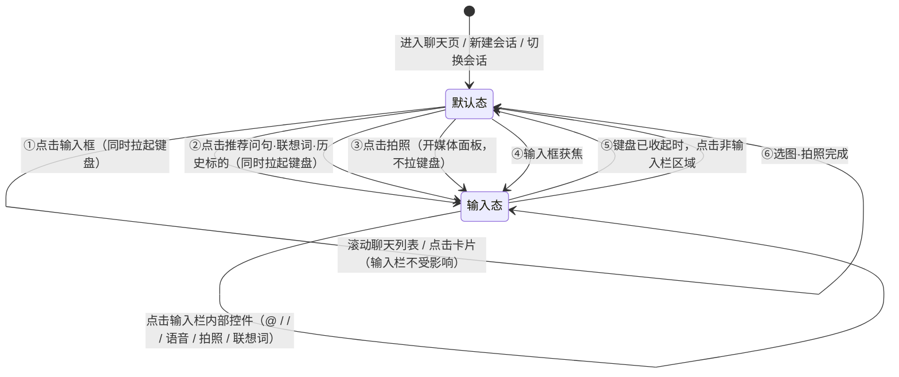

# 09 · 输入栏默认态与输入态转换规范

**项目**：股问 StockChat · AI 股票问答应用 Demo
**版本**：v1.0 ｜ **日期**：2026-08-28 ｜ **状态**：已实现（落地于 `shared/.../page/ChatPage.kt`）
**参照产品**：Kimi 首页输入区（两段式退出）
**上游文档**：06-渐进披露交互设计规范（同一条"按需给入，不打断任务流"的宪章）

---

## 1. 这份规范解决什么问题

改造前，输入栏的展开判据里混进了「键盘高度 > 0」：

```kotlin
// 改造前
private fun isComposerExpanded(): Boolean =
    inputFocused || inputPanel != NONE || inputText.isNotBlank() || keyboardHeight > 0f

keyboardHeightChange { keyboardHeight = it.height; inputFocused = it.height > 0f }
```

键盘一收，`inputFocused` 立刻变 false，输入栏被整体打回默认态。副作用很具体：

| 场景 | 改造前的表现 | 问题 |
|---|---|---|
| 打字时想回头看一眼上一条回答，点了一下聊天区 | 键盘收起 + 辅助区（最近标的 / @ 联想 / 发送键）全部消失 | 用户只是想"看一眼"，却被判成"结束输入" |
| 误触系统返回键 | 输入态整块丢失，只留一行空白 | 键盘收起 ≠ 放弃输入，两者被错误绑定 |
| 输入框里有草稿时点空白 | 草稿还在，发送键却没了 | 状态自相矛盾：有内容却没有出口 |
| 从推荐问句进入 | 键盘抬起时机依赖 TextArea 重新挂载 | 偶发"展开了但键盘没起来" |

**根因**：把「键盘可见性」当成了「输入意图」的判据。这两件事必须解耦——键盘是系统能力，输入意图是用户意图。

**目标行为（Kimi 式）**：输入态一旦进入就是**粘的**。收键盘不回退；只有「键盘已经收起之后，再点一下非输入栏区域」才回默认态。

---

## 2. 两个状态的定义

| 要素 | 默认态（Resting） | 输入态（Expanded） |
|---|---|---|
| 高度 | 单行胶囊（44dp 输入区 + 32dp 圆钮） | 多行输入区（最高 80dp）+ 工具行 |
| 左侧 | ＋ | 最近问过的标的横向 chips |
| 输入区 | 单行，可展示草稿，placeholder「问一只股票或一个术语」 | 多行，placeholder 相同 |
| 右侧 | 语音、拍照 | @ 、/ 、语音、拍照、**发送 / 停止** |
| 联想行 | 无 | `@` → 标的联想；`/` → 指令联想；拍照 → 媒体面板 |
| 键盘 | 不在屏 | 首次进入时在屏；可被收起且**不改变本状态** |
| 语义 | 「我还没打算说话」 | 「我正在组织一次提问」 |

一句话区分：**默认态是"入口"，输入态是"工作台"。**

---

## 3. 状态机

### 3.1 三条判据必须分开（正交，不可互相替代）

| 判据 | 字段 | 含义 | 由谁写 |
|---|---|---|---|
| **布局判据** | `isComposerExpanded()` | 渲染默认态还是输入态 | 派生，不落库 |
| **意图判据** | `composerExpanded` | 用户是否已进入"工作台"（**粘滞闩锁**） | 用户动作 |
| **键盘判据** | `keyboardVisible` / `keyboardHeight` | 系统键盘当前是否在屏 | 系统回调 |

`isComposerExpanded()` 由前两者派生：

```
isComposerExpanded = composerExpanded          // 意图（粘）
                  || inputPanel != NONE        // 面板被打开（拍照/@/指令）
                  || keyboardVisible           // 兜底：键盘在屏时必须是输入态
                  || keyboardHeight > 0f
```

> **注意**：`inputText.isNotBlank()` 已从判据中**移除**。草稿不再强制展开——否则"有草稿就永远收不回去"，退出路径会被堵死。草稿改为保留在默认态的输入框里（见 §3.3 D4）。

### 3.2 转换图



### 3.3 转换条件全表

**A · 进入输入态（默认态 → 输入态）**

| # | 触发 | 键盘 | 实现 |
|---|---|---|---|
| A1 | 点击输入框（默认态那一行） | 拉起 | `expandComposer(requestFocus = true)` |
| A2 | 点击推荐问句 / @ 联想词 / 指令联想词 / 历史标的 | 拉起 | `injectQuestion()` → `expandComposer(true)` |
| A3 | 点击拍照（打开媒体面板） | 收起 | `toggleMediaPanel()` → `inputPanel = MEDIA` |
| A4 | 输入框原生获焦（输入法回调） | 系统自行抬起 | `inputFocus { expandComposer() }` |

**B · 保持输入态（输入态 → 输入态，不回退）**

| # | 触发 | 说明 |
|---|---|---|
| B1 | 系统返回键 / 键盘收起键 | 只写 `keyboardVisible = false`，**不碰** `composerExpanded` |
| B2 | 点击空白（第一次） | 只收键盘（见 §4 两段式退出） |
| B3 | 发送成功 | 保留输入态与键盘，用户接着问下一句 |
| B4 | 点击输入栏内部控件 | 子视图消费点击，不触发外区点击逻辑 |
| B5 | 滚动聊天列表 | 滑动手势不产生 click，不触发外区点击逻辑 |

**C · 回默认态（输入态 → 默认态）**

| # | 触发 | 实现 |
|---|---|---|
| C1 | **键盘已收起时，点击非输入栏区域**（唯一的用户手势出口） | `handleOutsideTap()` → `collapseComposer()` |
| C2 | 图片/拍照选择完成 | `handleMediaAction()` → `collapseComposer()` |
| C3 | 新建会话 / 切换历史会话 | `resetSessionUiState()` → `collapseComposer()` |

**D · 边界规则**

| # | 情况 | 规则 |
|---|---|---|
| D1 | 有草稿时点空白收起 | 允许收起，草稿**保留**在默认态输入框里，不丢 |
| D2 | 默认态输入框里的草稿 | 高度封顶 44dp（`renderComposerTextArea(compact = true)`），撑不破默认态那一行 |
| D3 | 失焦（blur） | **绝不**因失焦回退：默认态与输入态各挂一个 TextArea，切换时会重新挂载并先抛一次瞬态 blur |
| D4 | 键盘在屏时点空白 | 只收键盘，输入栏不动（两段式的第一段） |
| D5 | 点击输入栏自身的留白（羽毛条 / 左右 12dp / 底部 10dp） | 由输入栏容器用一个空 click 吞掉，不穿透到聊天列表 |
| D6 | 卡片 / 气泡 / 建议 chips 上的点击 | 子视图自带 click，事件被消费，不影响输入栏 |

---

## 4. 核心规则：两段式退出（Kimi 式）

这是本规范唯一"反直觉"但必须遵守的一条。

```
输入态 + 键盘在屏
        │
        │ 点击非输入栏区域（第 1 次）
        ▼
输入态 + 键盘收起   ← 只是把键盘让出去，工作台还开着
        │
        │ 点击非输入栏区域（第 2 次）
        ▼
默认态
```

**为什么要点两次**：第一次点击时，用户的手已经伸向聊天内容了——他要的是"看清"，不是"结束"。如果一次点击就把工作台收掉，用户想继续打字就得重新点输入框、重新等键盘动画。分成两段后：

- 第 1 次点击 = 「让开地方」（收键盘，视线不被挡）
- 第 2 次点击 = 「我不问了」（收工作台）

两次点击的语义不同，代价也不同，因此不合并。

**判据**：`handleOutsideTap()` 先看键盘是否还在屏。

```kotlin
private fun handleOutsideTap() {
    if (keyboardVisible || keyboardHeight > 0f) {
        keyboardDismissed = true      // 只收键盘
        inputRef.view?.blur()
        return
    }
    collapseComposer()                // 键盘已收起 → 这一次才回默认态
    inputRef.view?.blur()
}
```

---

## 5. 实现映射（`shared/src/commonMain/kotlin/com/kuikly/stockchat/page/ChatPage.kt`）

### 5.1 状态字段

```kotlin
private var composerExpanded: Boolean by observable(false)  // 意图闩锁（粘）
private var keyboardVisible: Boolean by observable(false)   // 键盘是否在屏
private var keyboardDismissed = false                      // 键盘被主动收起过
private var keyboardHeight: Float by observable(0f)        // 布局避让用
private var inputPanel: InputPanel by observable(InputPanel.NONE)
```

`keyboardDismissed` 的作用：**阻止 TextArea 重新挂载时把键盘顶回来**。
它被写进 `autofocus(...)` 的取反项，只由用户主动动作改写：

| 动作 | `keyboardDismissed` |
|---|---|
| 点击输入框 / 输入框获焦（`expandComposer(true)` / `inputFocus`） | `false` |
| 点击空白收键盘 / 打开媒体面板 | `true` |
| 回默认态（`collapseComposer`） | `false` |
| 系统返回键收键盘 | **保持 false**（不改写 ⇒ autofocus 取值不变 ⇒ 不会重新弹键盘，但状态栏仍留在输入态） |

```kotlin
autofocus(
    inputPanel != InputPanel.MEDIA &&   // 媒体面板打开时不抢焦点
    composerExpanded &&                 // 必须是输入态
    !keyboardDismissed                  // 键盘没被用户主动收起
)
```

### 5.2 事件接线

| 事件 | 挂在 | 行为 |
|---|---|---|
| `click`（聊天列表 Scroller） | `Scroller` | `handleOutsideTap()` —— 输入态 → 默认态的唯一手势出口 |
| `click`（输入栏外层容器） | 输入栏容器 | 空实现，吞掉输入栏范围内的点击，避免穿透 |
| `click`（输入区） | 默认态 / 输入态 两处 | `expandComposer(requestFocus = true)` |
| `inputFocus` | TextArea | `keyboardDismissed = false` + `expandComposer()` |
| `inputBlur` | TextArea | 空实现（绝不回退） |
| `keyboardHeightChange` | TextArea | 只更新 `keyboardHeight` / `keyboardVisible` + 滚到底 |
| `inputReturn` | TextArea | `submitInput()` |
| `textDidChange` | TextArea | 更新草稿 + `updateInputPanel()` |

### 5.3 关键函数

| 函数 | 职责 |
|---|---|
| `expandComposer(requestFocus)` | 默认态 → 输入态；`requestFocus` 为真时清 `keyboardDismissed` 并 `focus()` |
| `collapseComposer()` | 输入态 → 默认态；清闩锁、关面板、停录音；**保留草稿** |
| `handleOutsideTap()` | 两段式退出的判据分流 |
| `isComposerExpanded()` | 布局判据（派生，读 observable 以驱动 Kuikly 重渲染） |
| `renderComposerTextArea(compact)` | 两态共用；`compact = true` 时高度封顶 44dp |

---

## 6. 验收清单

逐条跑一遍，全绿才算通过：

- [ ] 冷启动进入聊天页 → 默认态，**键盘不能自动弹起**
- [ ] 点输入框 → 输入态 + 键盘同时到位（不是先展开再等一拍）
- [ ] 输入态下点系统返回键 → 键盘收起，**输入态保持**（最近标的 / 发送键都还在）
- [ ] 键盘收起后再点一下聊天区 → 回到默认态
- [ ] 键盘在屏时点聊天区 → 只收键盘，输入栏不动；**再点一次**才收输入栏
- [ ] 输入态下有草稿 → 点两次空白回到默认态 → 草稿仍在输入框里，且那一行没被撑破
- [ ] 输入态下点发送 → 消息发出，输入栏保持输入态、键盘不收
- [ ] 输入态下点 @ / / / 语音 / 拍照 → 输入栏不回退
- [ ] 点拍照 → 媒体面板展开且键盘收起；再点一次拍照 → 回默认态
- [ ] 选图完成 → 直接回默认态
- [ ] 新建会话 / 切历史会话 → 回默认态，键盘收起
- [ ] 上下滚动聊天列表（含快速滑动）→ 输入栏状态不受影响
- [ ] 点输入栏四周 10~12dp 的留白 → 输入栏不回退（点击没穿透）
- [ ] 点消息气泡里的股票实体 / 建议 chips → 走各自的跳转，不顺带收起输入栏
- [ ] iOS / Android / 鸿蒙三端表现一致（`keyboardHeightChange` 是共用通道）

---

## 7. 待定与后续

| 议题 | 现状 | 建议 |
|---|---|---|
| 默认态是否保留发送键 | 无（草稿要发送需先展开） | 若后续埋点显示"有草稿时点空白"占比高，可给默认态加一个仅草稿态出现的发送键 |
| 两段式是否可配置为一段式 | 硬编码两段 | 若用户反馈"点两次太啰嗦"，可在设置里加 `退出方式：一次 / 两次` |
| 输入态下点卡片 | 不收键盘 | 如需"点卡片即结束输入"，在卡片 click 里补一次 `blur()` 即可，不改动状态机 |
| 语音录音中的退出行为 | 随 `collapseComposer()` 一起停 | 待语音功能实装后复核（录音中应禁止被外区点击打断） |
