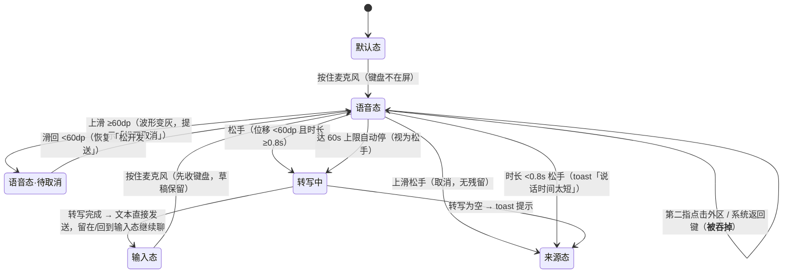

# 11 · 语音输入交互与动效规范

**项目**：股问 StockChat · AI 股票问答应用 Demo
**版本**：v1.2 ｜ **日期**：2026-08-30 ｜ **状态**：设计稿（待实施）
**修订**：v1.1 起录方式由「点按起录/点按结束」改为**按住说话 · 松手发送 · 上滑取消**（微信式）；转写结果**直接发送**，不再回填草稿。
v1.2 动效参数**对齐 WorkBuddy 真实实现**（本机 `app.asar` 源码核对，拆解见 §11）：麦克风按钮特效由"红底变色+脉冲"改为**话筒管内音量充填**（WorkBuddy 真身）；波形平滑改非对称（升 0.6 / 落 0.25）、采样 80ms→60ms、振幅改时域 RMS × 2.5 增益
**参照产品**：微信语音消息手势 + WorkBuddy 波形动效
**上游文档**：09-输入栏默认态与输入态转换规范（语音是输入栏的第三态）、10-@提及与斜杠指令规范、02-设计原则四条宪章、GlassTokens 玻璃材质规范
**配套预览**：`11-语音输入动效-预览.html`（可交互，含全部动效参数）

---

## 1. 这份规范解决什么问题

当前语音键是一个纯开关 mock（`ChatPage.kt`）：

```kotlin
// ChatPage.kt L184 —— 全部"语音功能"
private var voiceActive: Boolean by observable(false)

// 点击只是翻转一个布尔值：圆钮变红、麦克风图标换成红点，仅此而已
event { click { page.voiceActive = !page.voiceActive } }
```

没有录音、没有波形反馈、没有转写、没有发送闭环。用户点下去得到的唯一反馈是"按钮变红了"——这在语音交互里等于没有反馈。

### 1.1 语音对股问的真实价值

| 场景 | 打字的问题 | 语音的收益 |
|---|---|---|
| 盘中盯盘，单手/另一只手在翻行情 | 软键盘占半屏，挡住聊天内容 | 按住说一句，松手即发出，视线不离开盘面 |
| 股票名 / 代码难输入（"药明康德""00700"） | 切换键盘、翻候选词成本高 | 直接说出来，转写即得 |
| 术语提问（"什么是缩量十字星"） | 长句打字慢 | 一句话 3 秒说完 |
| 通勤路上 | 行走中打字易错 | 语音是唯一能用的输入方式 |

### 1.2 设计目标

> **语音输入是输入栏的"第三态"，与默认态 / 输入态平级，共享同一台状态机。**
> 手势语言与微信一致（按住说、松手发、上滑取消），学习成本为零；视觉反馈用 WorkBuddy 式振幅波形，状态一目了然。

- **G1 反馈即状态**：按住的全过程中，用户必须随时看到三件事——在录（波形在动）、录了多久（计时）、怎么结束（提示语「松开发送 · 上滑取消」）。波形必须**由真实振幅驱动**，不做假动画。
- **G2 不打断任务流**（宪章·聊看一体）：语音态只占输入栏本身，聊天区不被遮挡、不弹全屏浮层。
- **G3 与 09 状态机正交兼容**：录音是"输入意图"的一种，遵循同样的粘滞闩锁语义；录音中**禁止**被外区点击打断（收口 09 文档 §7 的遗留项）。
- **G4 松手即发，链路最短**：松手 → 转写 → 直接作为提问发出，不在输入框停留。用户对自己的话负责，手势的爽快感优先于二次确认（风险与对策见 §10）。

---

## 2. 目标与非目标

### 2.1 目标（Goals）

| # | 目标 | 衡量方式 |
|---|---|---|
| G-a | 语音提问端到端耗时可感知地短于打字 | 埋点：按住到消息发出 ≤ 打字句均时长的 40% |
| G-b | 起录反馈即时 | 手指按下到波形出现的延迟 ≤ 150ms（不含系统权限弹窗） |
| G-c | 取消无歧义、无残留 | 上滑取消 100% 不产生任何消息与网络请求 |
| G-d | 松手到消息出现在聊天区 ≤ 1.5s（模拟转写阶段 ≤ 800ms） | 真机计时 |

### 2.2 非目标（Non-goals）

| # | 不做 | 原因 |
|---|---|---|
| N1 | **不做实时流式 ASR**（边说边出字） | v1 无 ASR 服务依赖；架构上预留流式回调口（§7.3 P2） |
| N2 | **不做"发送前确认"编辑态** | 与「松手即发」的设计决策冲突；若误识别率证明不可接受，作为设置项后补（§10） |
| N3 | **不做语音播报 / TTS 回答** | 与"抑制冲动"宪章无关方向，单独立项 |
| N4 | **不做唤醒词 / 免提连续对话** | 场景不成立（盯盘是碎片场景，不是车载场景） |
| N5 | **不做语音消息**（发送音频本体） | 股问是人机问答，发送物是转写文本，不是音频 |
| N6 | **v1 不接入真实 ASR 厂商选型** | Demo 阶段以模拟转写闭环验证交互；选型（系统 ASR / 腾讯云 ASR）在工程排期前评审 |

---

## 3. 用户故事

- 作为**正在盯盘的用户**，我希望**按住麦克风说话、松手问题就发出去了**，以便**全程不把视线从行情移开**。
- 作为**按住说话中的用户**，我希望**看到波形随声音起伏、看到已录时长、看到「松开发送 · 上滑取消」的提示**，以便**确认 App 在听，也知道怎么收尾**。
- 作为**说错话的用户**，我希望**手指不抬、往上一滑再松开就能作废**，以便**重新组织语言且不留任何痕迹**。
- 作为**不小心碰了一下麦克风的用户**，我希望**太短的录音被识别为误触**，以便**不会发出一句莫名其妙的提问**。
- 作为**第一次使用语音的用户**，我希望**权限被拒时告诉我去哪开，而不是静默失败**。
- 边界：作为**按住说话时下意识滑出按钮的用户**，我希望**只要没上滑到取消区、松手就照常发送**——滑出按钮 ≠ 取消（与微信一致）。

---

## 4. 交互定义：输入栏的第三态

### 4.1 三个状态的关系

09 文档定义了默认态 / 输入态。语音是**与二者平级的第三态——语音态（Voice）**：

| 要素 | 默认态 | 输入态 | **语音态（新增）** |
|---|---|---|---|
| 触发 | 冷启动 / 收起 | 点输入框 | **按住麦克风**（两态均可进入） |
| 输入区 | 假输入条 | 多行 TextArea | **波形条 + 计时 + 手势提示**（TextArea 隐藏但**不销毁**，见 §4.4 V7） |
| 左侧 | ＋ | 最近标的 chips | ＋（置灰禁用） |
| 右侧 | 语音、拍照 | @ / 语音 / 拍照 / 发送 | 保持原位但**全部禁用**——按住期间唯一出口是手指本身 |
| 键盘 | 不在屏 | 在屏或已收起 | **按下瞬间强制收起**（录音与打字互斥） |
| 语义 | "我还没打算说话" | "我正在组织一次提问" | "我正在用嘴提问" |

> 与 v1.0 的差异：语音态内**不再出现 × / ✓ 出口键**。按住手势的出口就是「松手」与「上滑」，按钮出口反而诱导用户松开手指去点，破坏手势闭环。

### 4.2 起录与结束（核心手势链）

| # | 手势 | 结果 | 优先级 |
|---|---|---|---|
| T1 | **按下麦克风**（touchDown） | 收键盘 → 进入语音态 → 起录，波形/计时/提示语出现 | **P0** |
| T2 | **按住不动，松手**（touchUp，位移 < 取消阈值） | 停录 → 转写 → **直接发送** | **P0** |
| T3 | **按住上滑 ≥ 60dp 后松手** | 停录 → **取消**，无任何残留 | **P0** |
| T4 | 上滑进入取消区后**又滑回来**再松手 | 恢复待发送态，松手照常发送（与微信一致） | **P0** |
| T5 | 按下后 < 0.8s 即松手 | 视为误触：toast「说话时间太短」，不发送 | **P0** |
| T6 | 按住滑出按钮但未达取消阈值，松手 | **照常发送**——滑出按钮不等于取消 | **P0** |
| T7 | 点按起录 / 点按结束（tap-to-toggle） | 不做。与按住手势在同一按钮上必然冲突 | — |

> **为什么是按住而不是点按**：按住手势把「确认发送」内建进了动作本身——手指抬起的瞬间就是提交，比"点一下开始、再点一下结束"少一次决策；且微信已教育了全量中文用户，零学习成本。Kuikly 2.25 已核对具备完整手势链 API（§7.2），无技术障碍。

### 4.3 状态机



**按下瞬间做的事（按序，目标 ≤150ms 出波形）**：

1. `keyboardVisible` 为真则先收键盘（`inputRef.view?.blur()`）；
2. 置 `composerExpanded = true`（语音态复用输入态的容器高度与玻璃壳）；
3. `voiceState = RECORDING`，`voiceCancelArmed = false`，启动录音桥（§7），启动计时与振幅轮询；
4. 输入区 morph：TextArea 淡出 120ms → 波形条 + 计时 + 提示语淡入 180ms（错峰 60ms，同 08 的退场先行原则）；
5. 输入栏其余按钮置灰禁用（视觉 40% 透明 + `touchEnable(false)`）。

**松手（发送路径）做的事（按序）**：

1. 停录音桥、停计时、停振幅轮询；
2. 波形向中轴收线淡出（240ms，`easeIn`）；
3. `voiceState = TRANSCRIBING`，输入区显示「转写中…」呼吸占位（`textTertiary`，12sp）；
4. 转写回调到达 → `viewModel.submitInput(transcript)` **直接发送**（用户气泡 + 走正常提问管线）→ `voiceState = IDLE`；
5. 回到来源态：从默认态按住进来的回默认态；从输入态进来的回输入态（草稿原样保留，转写文本**不进草稿**）。

### 4.4 边界规则（与 09 的 D 表对齐）

| # | 情况 | 规则 |
|---|---|---|
| V1 | **录音中第二指点聊天区 / 消息卡片 / 系统返回键** | 一律吞掉，录音继续。录音的退出**只能**是松手（收口 09 §7 遗留项） |
| V2 | 录音时长上限 | 60s 硬上限，到点自动停并转写发送；55s 时计时变 `rise` 红提示 |
| V3 | 录音过短 | < 0.8s 视为误触，toast「说话时间太短」，不发送、无残留 |
| V4 | 进入语音态时有草稿 | 草稿**原样保留**，转写文本直接发送、不与草稿合并。回来后草稿还在输入框 |
| V5 | 取消阈值 | 上滑位移 ≥ **60dp**（`touchDown.pageY − touchMove.pageY`）进入待取消；滑回 <60dp 恢复 |
| V6 | 待取消态视觉 | 波形与管内充填由 `rise` 红变 `textTertiary` 灰（200ms 过渡），提示语变为「松开手指，取消发送」且变灰 |
| V7 | TextArea 实例 | 语音态下 TextArea **隐藏不销毁**（`opacity(0f)` + `touchEnable(false)`），避免 vif 重建引发的焦点/IME 乒乓（09 落地时的血泪教训） |
| V8 | 权限被拒 | toast「需要麦克风权限才能语音提问」+「去开启」跳转系统设置；**不进入语音态**（在 touchDown 路径上同步检查，已授权过则零延迟） |
| V9 | 麦克风被占用（通话中等） | 录音桥返回错误 → 回来源态 + toast「麦克风被占用，请稍后再试」 |
| V10 | 按住中来新行情 / 流式回答 | 聊天区照常刷新，语音态不受打扰（聊看一体） |
| V11 | touchMove 越界回调 | 手指滑出按钮后 touchMove 是否持续回调需**真机首日验证**（Android 触摸捕获通常持续到 touchUp；若不持续，降级方案：以最后一次已知位移判定） |

---

## 5. 动效规范（仿 WorkBuddy）

> 全部动效参数已做成可交互预览：`11-语音输入动效-预览.html`。下表为**参数真源**，实现以表为准。

### 5.1 三个动效组件

**① 麦克风圆钮 —— 管内音量充填（WorkBuddy 真身，§11 源码核对）**

WorkBuddy 的"波形"不是一排波形柱，而是**麦克风图标话筒管内的充填动画**：话筒管作为 clipPath，一块矩形随音量**从管底向上充填**。这是指纹级特征，照抄：

| 参数 | 值（WorkBuddy 源码 → 股问映射） | 说明 |
|---|---|---|
| 图标规格 | 16×16 viewBox（源码）→ 股问沿用现有 17–19dp `LineIconMic` | 管内嵌 1dp（源码 `TUBE_INSET=1`） |
| 充填高度区间 | 源码 `1.5 → 6`（16 视窗内）→ 等比映射到股问图标 | 静默时保持 1.5 最低充填，不归零（"在听"语义） |
| 充填方向 | 管底 → 管顶（源码 `VOL_BASE_Y=9` 向上） | — |
| 充填色 | 源码 `#00C29A` 青绿（`--cb-voice-confirm-color`）→ **股问用 `rise` #FF4D4F**（视觉基线） | 圆钮底色**不变红**，充填即唯一反馈（WorkBuddy 无脉冲、无底色切换） |
| 待取消态 | 充填色 200ms 过渡为 `textTertiary` 灰 | 取消区里不给"活"的信号 |
| 移动端附加 | touchDown 时圆钮 scale 1.0→1.12（120ms easeOut），松手 150ms easeIn 回弹 | WorkBuddy 是桌面端无此按压反馈；移动端按住手势需要，属新增不属仿造 |

> v1.1 的"红底 + 扩散脉冲"方案**废弃**：源码证实 WorkBuddy 按钮壳体全程不动，充填本身就是活的反馈，比脉冲更克制（宪章·抑制冲动）。

**② 波形条 —— 振幅驱动（股问扩展，WorkBuddy 无此组件）**

输入区的 24 条波形是股问在 WorkBuddy 信号处理之上做的**移动端扩展**（WorkBuddy 桌面端输入区不展开波形，只有按钮充填）。信号参数全部对齐源码：

| 参数 | 值 | 说明 |
|---|---|---|
| 条数 | **24** | 中轴对称 |
| 条宽 / 间距 | 3dp / 3dp | 居中于输入区 |
| 高度区间 | 4dp – 28dp | 静默时落到 4dp 不消失（保持"在听"语义） |
| 采样节奏 | **60ms**（源码 `SAMPLE_INTERVAL_MS=60`） | 过密掉帧，过疏失真 |
| 音量算法 | **时域 RMS**（源码注释：比 frequency data 更适合"总音量"，对说话停顿响应更线性） | 录音桥 actual 端直接输出 RMS，不做 FFT |
| 映射 | `amp = min(1, rms × 2.5)`（源码增益 2.5）；`h = 4 + 24 × amp^0.6` | 增益抬整体响度，指数 <1 再抬小声可读性 |
| 平滑 | **非对称**：上升 0.6 / 下落 0.25（源码 `target>prev ? .6 : .25`，快攻慢放） | 视觉跟手又不抖；v1.1 的对称 0.35 废弃 |
| 颜色 | 正常 `rise` #FF4D4F，alpha 由中轴向两侧 1.0 → 0.55 衰减；待取消整组过渡为 `textTertiary` | 颜色即取消状态的第二通道（第一通道是提示语） |
| 基线形态 | 各条静态高度服从 `cos` 包络（中间高两端低） | 无输入时也是"波形"而非"一排棍子" |
| 按钮充填同步 | 同一帧 RMS 同时驱动 ① 的管内充填 | 一个数据源，两处渲染 |

**③ 输入区 morph —— TextArea ⇄ 波形条**

| 阶段 | 时长 | 缓动 | 说明 |
|---|---|---|---|
| TextArea 淡出 | 120ms | easeIn | 退场先行，加速离开 |
| 波形 + 提示语淡入 | 180ms | easeOut（`cubic-bezier(.05,.7,.1,1)`） | 与淡出错峰 60ms，容器**不变高**（44dp 单行） |
| 松手：波形收线淡出 | 240ms | easeIn | 向中轴收成细线再消失，像"声音被收走" |
| 发送：用户气泡入场 | 240ms | easeOut | 复用聊天区既有气泡入场动效，不新造 |

### 5.2 计时与提示语

- 计时格式 `0:07` / `1:23`，等宽数字，13sp `textSecondary`，位于波形左侧；55s 后变 `rise` 并 600ms 呼吸。
- 提示语位于波形下方或右侧（按宽度自适应），12sp `textSecondary`：
  - 正常：「松开发送 · 上滑取消」
  - 待取消：「松开手指，取消发送」（同步变灰）
- 提示语是**必备项**不是装饰：它是取消手势唯一的可见教学（G1）。

### 5.3 玻璃与材质

语音态复用输入态的 `glass.sheet` 材质，**不新增玻璃档位**（GlassTokens 私有构造约束）。录音中的唯一"材质事件"是管内充填与波形起伏，壳体与圆钮底色全程不动——玻璃是容器，不是舞台灯（与 WorkBuddy 一致）。

---

## 6. 发送路径：不进输入框，天然绕开 IME 雷区

v1.0 的"回填草稿再编辑"方案需要命令式 `setTextInputState` 注入 TextArea，时刻提防 IME 组合态回声。v1.1 改为**松手直接发送**后，转写文本完全不经过输入框：

```kotlin
private fun onTranscriptReady(transcript: String) {
    if (transcript.isBlank()) { toast("没听清，请再说一次"); return }
    viewModel.submitInput(transcript)   // 走与打字发送完全相同的管线：用户气泡 → 流式回答
    voiceState = VoiceState.IDLE
}
```

收益：IME 回声循环、选区丢失、组合态被杀这一整类风险**在语音链路上结构性不存在**。草稿（若有）全程未动，回来源态后原样可见。

---

## 7. 技术实现映射

### 7.1 状态字段（`ChatPage.kt`）

```kotlin
enum class VoiceState { IDLE, RECORDING, TRANSCRIBING }

private var voiceState: VoiceState by observable(VoiceState.IDLE)  // 替换现有 voiceActive 布尔
private var voiceCancelArmed: Boolean by observable(false)         // 上滑 ≥60dp 待取消
private var voiceElapsedSec: Float by observable(0f)               // 计时（0.1s 粒度）
private var voiceAmps: FloatArray by observable(FloatArray(24))    // 波形振幅
private var voiceTouchDownPageY = 0f                               // 取消阈值的位移基准
// voiceActive 删除——它是 mock 的遗物，voiceState != IDLE 即其语义全集
```

布局判据扩展（与 09 §3.1 的派生规则合并）：

```
isComposerExpanded = composerExpanded || inputPanel != NONE
                  || keyboardVisible || keyboardHeight > 0f
                  || voiceState != IDLE          // 语音态强制输入态容器
```

### 7.2 手势链（Kuikly 2.25 已核对 `core-2.25.0-2.1.21-sources.jar`）

`EventName` 提供 `touchDown` / `touchMove` / `touchUp`，`TouchParams` 带自身坐标 `x/y`、页面坐标 `pageX/pageY`、`timestamp`、`pointerId`——取消判定所需信息齐全：

```kotlin
// 麦克风圆钮
event {
    touchDown { e ->
        if (!ensureMicPermission()) return@touchDown          // V8
        voiceTouchDownPageY = e.pageY
        startVoiceSession()                                    // §4.3 按下五件事
    }
    touchMove { e ->
        if (voiceState != VoiceState.RECORDING) return@touchMove
        voiceCancelArmed = (voiceTouchDownPageY - e.pageY) >= 60f   // V5/V6
    }
    touchUp { e ->
        if (voiceState != VoiceState.RECORDING) return@touchUp
        when {
            voiceCancelArmed -> cancelVoiceSession()           // T3：取消，无残留
            voiceElapsedSec < 0.8f -> abortTooShort()          // T5/V3：toast
            else -> finishVoiceSession()                       // T2：停录 → 转写 → 发送
        }
    }
}
```

注意：
- 同一按钮上**不再注册 click**（与 touchUp 双击语义冲突）；
- 按住期间输入栏其余按钮 `touchEnable(false)`（§4.3 第 5 步）；
- V11：touchMove 越界回调持续性需真机首日验证，不达标则用"最后已知位移"降级。

### 7.3 录音桥（expect/actual，新增 `shared/.../voice/VoiceRecorder.kt`）

```kotlin
// commonMain
expect class VoiceRecorder {
    fun start(onAmplitude: (Float) -> Unit, onError: (VoiceError) -> Unit)
    fun stop(): String?          // 返回音频文件路径；v1 可为 null（模拟转写）
    fun cancel()                 // 丢弃音频，不产生文件
}
enum class VoiceError { PERMISSION_DENIED, MIC_OCCUPIED }
```

| 端 | actual 实现要点 |
|---|---|
| Android | `MediaRecorder`（AAC/m4a 到 cacheDir）；`RECORD_AUDIO` 运行时权限；振幅由 PCM 帧算**时域 RMS**（对齐 WorkBuddy，不用 `maxAmplitude` 瞬时值——对说话停顿响应更线性） |
| iOS | `AVAudioRecorder` + `AVAudioSession.record` 权限；同样输出时域 RMS（`averagePower` dB 换算后可近似，优先直接算 PCM RMS） |
| 鸿蒙 | `@ohos.multimedia.audio` AudioCapturer；权限 `ohos.permission.MICROPHONE`；PCM 帧算 RMS |
| H5 | v1 降级：语音键不渲染（`MediaRecorder` 兼容性 + 权限体验差，H5 不是主战场） |

振幅轮询：commonMain 侧 **60ms** 定时器调 actual 采样口取 RMS，UI 层做 `min(1, rms×2.5)` 增益、非对称平滑（升 0.6 / 落 0.25）与 `cos` 包络，写入 `voiceAmps`（参数真源见 §5.1 ②，全部对齐 §11 的 WorkBuddy 源码值）。

### 7.4 需求分级（MoSCoW）

| 级别 | 内容 |
|---|---|
| **P0（Must）** | 按住/松手/上滑取消全手势链（T1–T6）、24 条振幅波形、计时、提示语、V1–V11 边界、模拟转写**直接发送**闭环、Android 真机权限流 |
| **P1（Should）** | iOS/鸿蒙 actual 桥、55s 倒计时变红呼吸、转写失败 toast + 允许立即重录 |
| **P2（Could / 保险）** | 流式 ASR 增量回调口（`onPartial(text)` 预留）、设置项「语音发送前确认」（默认关，见 §10）、波形条数按屏宽自适应 |

### 7.5 待改文件清单

| 文件 | 改动 |
|---|---|
| `page/ChatPage.kt` | `voiceActive` → `voiceState` 三态 + `voiceCancelArmed`；麦克风按钮 click 改 touchDown/touchMove/touchUp；语音态布局分支（V7 隐藏不销毁）；`collapseComposer()` / `resetSessionUiState()` 里的"停录音"钩子升级为 `recorder.cancel()` |
| `page/components/VoiceBar.kt`（新增） | 波形条 + 计时 + 提示语，纯渲染组件，状态全由 ChatPage 注入 |
| `voice/VoiceRecorder.kt`（新增） | expect/actual 录音桥 |
| `page/components/LineIcons.kt` | `LineIconMic` 升级为**带管内充填**的版本（clipPath + 充填 rect，充填高度为参数）；`LineIconRecordingDot` 随脉冲方案废弃删除；v1.0 的 ×/✓ 图标**不再需要** |
| `androidApp/` `iosApp/` `ohosApp/` | actual 实现 + 权限声明（`AndroidManifest.xml` / `Info.plist` / `module.json5`） |

---

## 8. 指标

| 指标 | 类型 | 目标 | 口径 |
|---|---|---|---|
| 语音键使用率 | 领先 | ≥ 8% 会话内按住过麦克风 | 按住 / 进入聊天页会话 |
| 录音完成率 | 领先 | ≥ 85% | 松手发送 /（发送 + 上滑取消 + 误触中止） |
| 上滑取消率 | 健康 | 5%–20% 区间 | 过低说明没人发现取消手势（提示语失效），过高说明误识别或误起录严重 |
| 语音提问占比 | 滞后 | 30 天内 ≥ 10% 提问来自语音 | 语音发送 / 全部发送 |
| 语音提问追问率 | 健康 | 不显著高于打字提问 | 若明显偏高，说明转写质量差导致答非所问（接 ASR 后复核） |
| 权限拒绝流失率 | 健康 | ≤ 30% | 拒绝后 7 天内未再使用语音 |

---

## 9. 验收清单

真机（7e885db2）逐条跑，全绿才算过：

- [ ] 默认态按住麦克风 → 输入区 morph 成波形 + 计时 + 提示语，**延迟 ≤ 150ms**；圆钮 scale 1.12，**话筒管内红色充填随音量起伏**（WorkBuddy 真身效果）
- [ ] 输入态（键盘在屏）按住麦克风 → 键盘先收、波形到位，**草稿原样保留**
- [ ] 按住说话 → 24 条波形与管内充填**同帧随音量起伏**（一个 RMS 数据源），静默时波形落 4dp、充填保持最低位不消失
- [ ] 按住期间提示语显示「松开发送 · 上滑取消」
- [ ] 按住上滑 ≥60dp → 波形与充填变灰、提示语变「松开手指，取消发送」；滑回 <60dp → 恢复红色待发送
- [ ] 待取消态松手 → 回来源态，**无气泡、无 toast、无网络请求**
- [ ] 正常松手 → 波形收线淡出 → 「转写中…」→ **转写文本直接作为用户气泡发出**，走正常流式回答
- [ ] 按住 < 0.8s 松手 → toast「说话时间太短」，无发送
- [ ] 按住滑出按钮（未上滑）松手 → **照常发送**（滑出 ≠ 取消）
- [ ] 按住中第二指点聊天区 / 消息卡片 / 系统返回键 → 录音继续，输入栏纹丝不动（V1）
- [ ] 有草稿时发送语音 → 草稿不进发送内容、发送后草稿仍在输入框（V4）
- [ ] 首次使用拒绝权限 → toast + 去开启跳系统设置；拒绝后再按住 → 仍走 V8，不死循环
- [ ] 55s 计时变红呼吸，60s 自动停并发送
- [ ] 按住中切后台 → 录音安全停止并回来源态（不僵尸录音）
- [ ] touchMove 滑出按钮后回调持续（V11 首日验证项；不达标走"最后已知位移"降级）
- [ ] 按住中收到流式回答 → 聊天区正常刷新，波形不卡帧（掉帧优先砍插值平滑，不砍采样）

---

## 10. 待定与后续

| 议题 | 现状 | 建议 |
|---|---|---|
| **误识别直接发出的风险** | 松手即发，识别错（如股票名谐音）会直接变成提问发出 | 接受该风险换取链路最短（G4 决策）。对策：①「语音提问追问率」指标监控（§8）；② P2 设置项「语音发送前确认」，开启后走 v1.0 的回填草稿方案（代码上保留 `applyTranscript` 分支，成本极低） |
| 模拟转写的假数据源 | 写死一句「帮我看看贵州茅台最近的走势」 | 接 `EntityRecognizer` 同款 mock 池，按录音时长随机取句 |
| ASR 厂商选型 | v1 不接 | 评审维度：中文金融词库（股票名/术语）、流式延迟、按量成本、端侧隐私合规（个保法） |
| 波形性能 | 24 条 × 60ms | 若低端机掉帧，先降采样到 100ms，再减条数到 16，不动非对称平滑算法 |
| H5 端 | 语音键隐藏 | 若 H5 后续要成为分享落地页主入口，再评估 `MediaRecorder` 方案（WorkBuddy 桌面端就是 Web Audio 管线，H5 可直接复用其参数） |

---

## 11. 附录：WorkBuddy 语音输入实现拆解（源码核对）

> 来源：本机 `D:\软件\WorkBuddy\resources\app.asar`（v5.3.14）解包，组件位于 `packages/agent-ui/src/components/voice-input/`。以下为真实实现，非印象。

### 11.1 交互与状态机（桌面端）

- **点按起录/点按结束**：点麦克风 → `recording`；录音中原麦克风位变成浅色 pill：`[充填麦克风图标] [时长] [×取消] [✓确认]`。✓ → 停录送 ASR（`processing`，pill 缩成单个 spinner）；× → 取消。另有快捷键（可配置）与 Esc 取消；**切换会话时若在录音，自动停录并送 ASR**。
- **转写结果回填输入框草稿**（`setInputBlocks(prev => [...prev, {type:"text", text}] )`），**不直接发送**——桌面端要二次确认。
- 时长上限 **60s**（`setTimeout(60*1e3)` 到点自动走"停止+ASR"）；ASR 超时 **30s**（`ASR_TIMEOUT_MS=3e4`）；出错 **3s** 自动恢复 idle（`ERROR_AUTO_RECOVER_MS`）。
- 权限：先经 PermissionProvider 弹应用内提示卡片，再 `getUserMedia`；`requesting_permission` 期间麦克风按钮显示 spinner。

### 11.2 动效真身：管内音量充填（VoiceWaveform）

```tsx
// 源码核心（16×16 viewBox，话筒管为 clipPath，rect 从管底向上充填）
SAMPLE_INTERVAL_MS = 60; TUBE_INSET = 1;
VOL_MIN_H = 1.5; VOL_MAX_H = 8 - TUBE_INSET * 2;   // 1.5 → 6
const rms = computeRms(analyserNode);              // 时域 RMS（Uint8 时域数据）
const target = VOL_MIN_H + Math.min(1, rms * 2.5) * span;
// 非对称平滑：快攻慢放
const next = target > prev ? prev + (target-prev)*.6 : prev + (target-prev)*.25;
// 充填色 #00C29A（--cb-voice-confirm-color）；rect 有 CSS transition 0.08s ease-out
```

源码注释明确选了**时域 RMS 而非频域**："比 frequency data 更适合做'总音量'，对说话停顿响应更线性"。录音管线为 WAV 16kHz（AudioWorklet，降级 ScriptProcessor）或 MediaRecorder webm/ogg。

### 11.3 对照决策表（WorkBuddy 桌面 vs 股问移动）

| 维度 | WorkBuddy 桌面端 | 股问移动端（本规范） | 决策理由 |
|---|---|---|---|
| 起录/结束 | 点按起录 + ✓/× 按钮 | **按住说话 · 松手发送 · 上滑取消** | 触屏 vs 鼠标的手势差异；微信已教育移动端用户 |
| 按钮特效 | **管内音量充填**（青绿） | **照抄**，色换 `rise` 红（视觉基线） | 指纹级特征，参数全部对齐 |
| 输入区波形 | 无（只有 pill） | 24 条波形条（移动端扩展） | 手机屏小、按住时手指挡住按钮，需要输入区大目标反馈 |
| 音量信号 | 时域 RMS × 2.5，60ms，非对称平滑 .6/.25 | **全部照抄** | 源码验证过的参数，不重新发明 |
| 转写去向 | 回填输入框草稿 | **直接发送**（移动端 G4 决策） | 桌面有键盘便于改稿；手机改稿成本高，且已用「追问率」指标+设置项对冲风险 |
| 时长上限 | 60s 自动停 | **一致**（60s，55s 变红） | — |
| 出错恢复 | 3s 自动回 idle | 一致（toast + 立即可重录，P1） | — |
